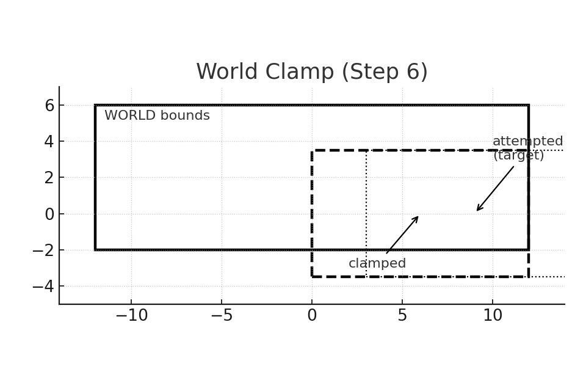

## License
This project is licensed under the **UZ Learn Try Personal Education License (UT-PEL) v1.0**.  
**Not** open source. **Personal self-learning only.** No redistribution, no public hosting, no derivatives, no commercial or instructional use, and no AI/data-mining. See [LICENSE](../LICENSE).

---

# Lesson 10 — Side-View Camera Rig for 2.5D (Three.js)

This lesson turns your scene into a **side-view camera system** for a 2D game inside a 3D world: dead‑zone follow → parallax layers → tiling BG/FG → world bounds + clamp → visual presets.

**Read more:** [Full Lesson 10 Guide (DOCX)](sandbox:/Lesson10_CameraRig_Readme+Guide.docx)

---

## Visual Overview

*Description:* The outer rectangle is the camera view in world units. The dashed inner box is the **dead‑zone** (40%×30% of the view). The camera only moves when the player exits this box; the `+` marks the camera center.

*Description:* A green rectangle represents the **WORLD bounds**. The dashed view shows the **desired target**; the solid view shows the **clamped** result so the camera never reveals space outside the level.

*Description:* For a given `camX`, each layer gets an offset `camX*(1−f)`. Background (f≈0.25) moves least, foreground (f>1) moves most, mid/gameplay (f=1) tracks the camera exactly.

*Description:* The camera (solid) eases toward the target (dashed) using a **critically‑damped spring** (k=60, c=2√k): quick response, minimal overshoot, stable at rest.

---

## Steps at a Glance (1–7)

1. [Step 01 — Ortho Side‑View Base](./10-01-ortho-side-view.html)
   Set up pixel‑consistent **orthographic** camera with **PPU**, gradient sky, minimal scene, player proxy, and **dead‑zone HUD**. Basic critically‑damped follow.

2. [Step 02 — Debug Bars & Parallax Presets](./10-02-pixel-scale-and-safe-area.html)
   Add three columns of **debug bars** (bg/mid/fg) to visualize relative motion. Introduce **parallax presets** (keys 1–4) to compare layer factors quickly.

3. [Step 03 — Repeating BG/FG Tiling](./10-03-parallax-layers.html)
   Build small **tile prefabs** for BG/FG and reposition them based on camera to create infinite horizontal looping; optional zebra tint and tile‑bounds toggle.

4. [Step 04 — Density / PPU Control](./10-04-tiling-background.html)
   Hotkeys **K/L** adjust **PIXELS_PER_UNIT**; recompute ortho frustum so world‑to‑pixel mapping remains stable across window sizes and zoom levels.

5. [Step 05 — Dead‑Zone Polish](./10-05-follow-camera-deadzone.html)
   Make DZ size tweakable (`[ ]` width, `; '` height). Fine‑tune spring constants for smooth, responsive camera behavior.

6. [Step 06 — World Bounds & Clamp](./10-06-bounds-and-clamp.html)
   Add `{minX,maxX,minY,maxY}` world rectangle. **Clamp** desired camera center by half‑view margins; if **view ≥ world**, **center** instead of clamp. Fix perspective toggle by deriving view from `persp.fov` and refreshing rig immediately.

7. [Step 07 — Visual Presets & Polish](./10-07-presets-and-polish.html)
   **Filmic** (DPR‑aware) vs **Pixel‑Art** (DPR=1 + `image-rendering: pixelated` + **pixel‑snap** for camera/player). Optional letterbox mask; keep **single** `applyParallax()` shared by layers, tiles, and bars.

---

## Key Techniques (recap)

- **Pixel‑consistent Ortho:** derive half‑view from window size and PPU.  
- **Dead‑Zone Follow:** only move when player exits DZ; feed into a critically‑damped spring.  
- **World Clamp:** limit view center so edges stay inside the world; center when view ≥ world.  
- **Parallax Layers:** per‑layer factor `f` drives offsets (`bg < mid < fg`).  
- **Horizontal Tiling:** lightweight, repeating strips for BG/FG bound to camera.  
- **Presets & Polish:** visual mode toggle, letterbox, reset, robust perspective switch.

— Updated 2025-09-17 13:37 UTC

---

## Trademark Notice

**UZ LEARN TRY™** is the brand identity of this project.  
The name and materials are provided strictly for personal educational purposes.  
All rights reserved.
