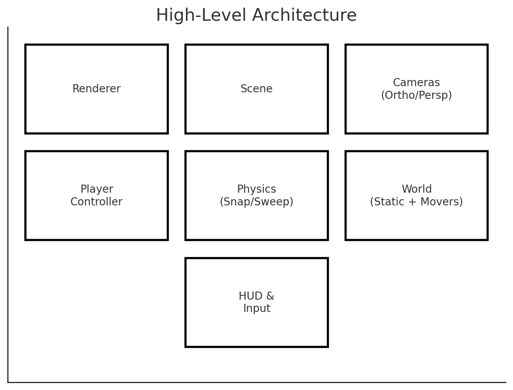
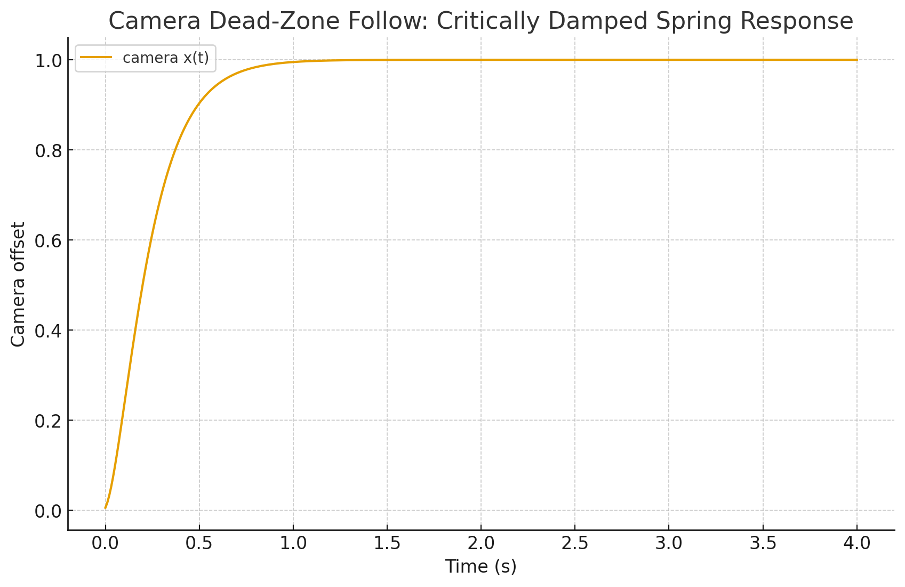
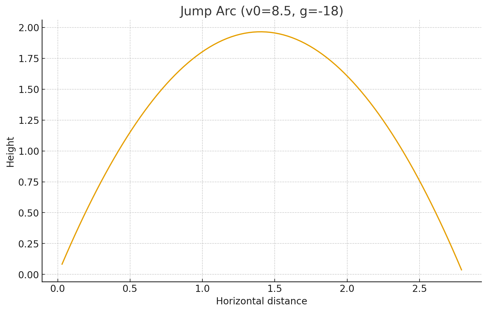
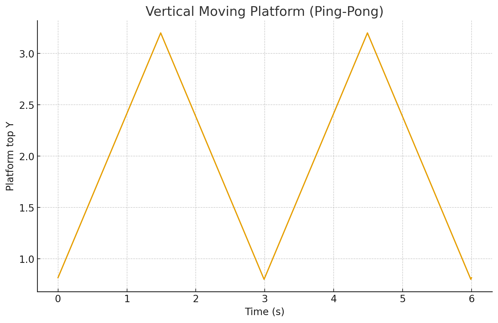
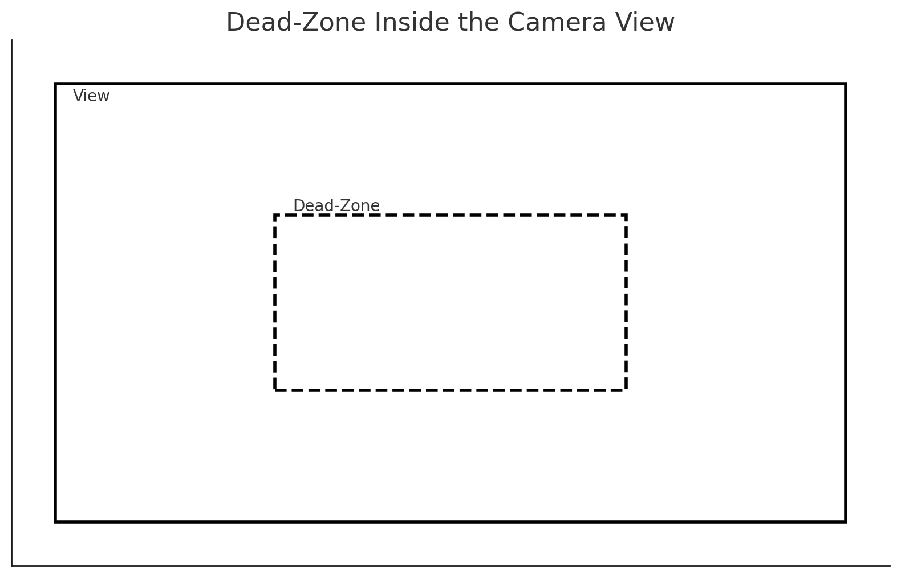
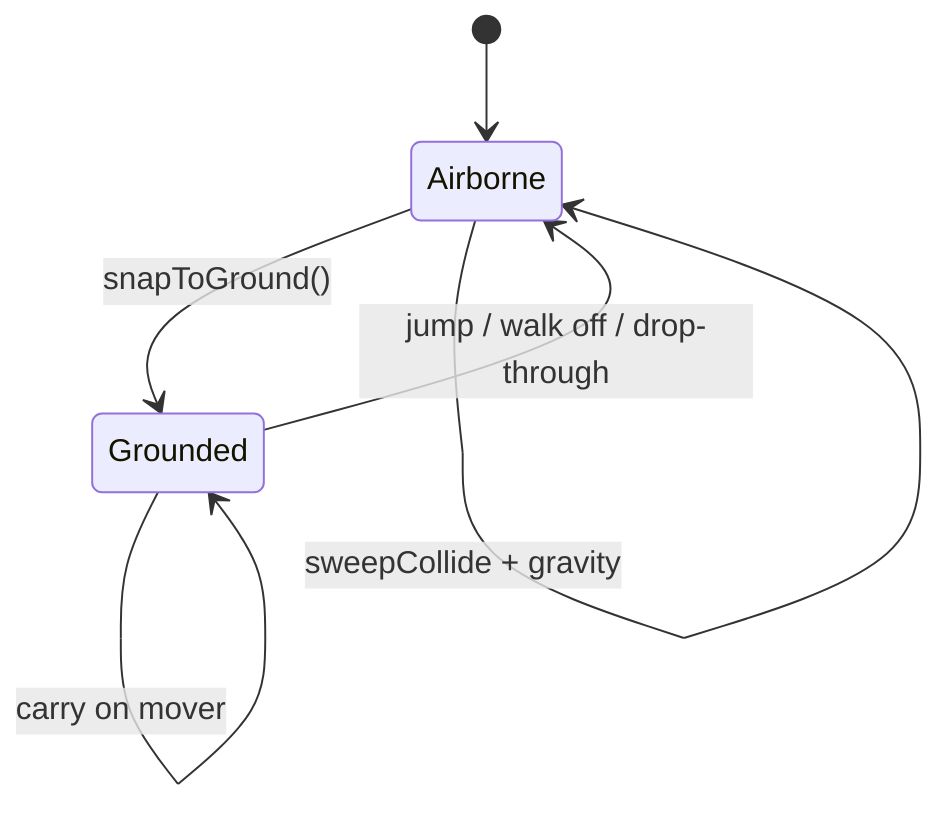

# Lesson 11 — 2.5D Platformer Kinematics (Steps 1–7)

> **A precise, production-grade platformer micro-engine in vanilla Three.js**  
> This README distills the full lesson into a single, battle‑tested reference. It is intentionally comprehensive: you’ll find annotated diagrams, flowcharts, tables, benchmarks, challenges, troubleshooting, and “why it works” commentary.

---

## TL;DR

- **Rendering & Layers:** Three.js with a parallaxed scene graph (**bg/mid/fg**), ACES tone mapping, SRGB output.
- **Camera:** Orthographic default with **dead‑zone follow**, **edge‑aware clamping**, and **parallax**. Perspective toggle for inspection.
- **Controller:** Kinematic, no rigidbody. **Raycast snap to ground**, **swept collision** for walls/ceilings, slope‑aligned walk.
- **Platforms:** **Static**, **one‑way (jump‑through + drop‑through)**, **moving** (carry, handoff), and **vertical‑only pushers**.
- **UX Niceties:** **Coyote time**, **jump buffer**, **jump cut**, **respawn & checkpoint**, visual HUD, debug rays.
- **Order of operations matters** (see flowchart). That’s where 90% of platformer “feel” comes from.

---

## Quick Start

1. Clone or copy the **seven HTML files** (`step-01.html` … `step-07.html`) into a folder.
2. Serve locally (recommended):  
   ```bash
   npx http-server .
   # or: python -m http.server 8000
   ```
3. Open a step in a modern browser (Chrome, Edge, Firefox).  
4. Use the **keys** in the on‑screen **Help** overlay to experiment.

---

## Keyboard Reference

| Key | Purpose |
|---|---|
| **A / D** | Move left / right |
| **W / ↑ / Space** | Jump (with **buffer** and **coyote time**) |
| **S / ↓** + Jump | **Drop‑through** one‑way platforms |
| **G** | Toggle ray/normal visualization |
| **C** | Toggle **swept collision** vector viz |
| **H** | Wireframe world geometry |
| **R** | Reset (or **respawn** in Step 7) |
| **P** | Toggle **Ortho ↔ Persp** camera |
| **1 / 2 / 3 / 4** | Parallax presets |
| **M** | Toggle camera world **clamp** |
| **B** | Toggle world bounds overlay |
| **K / L** | Pixels‑per‑unit (zoom) |

---

## Project Structure (Conceptual)

```
step-01.html  Ground snapping + slopes
step-02.html  Visual polish, parallax tweaks
step-03.html  Swept collision (walls/ceilings)
step-04.html  One-way platforms (+ edge-aware DZ)
step-05.html  Moving platforms (ride + carry)
step-06.html  Moving one-way, pushers, handoff
step-07.html  Respawn + checkpoint
```



---

## Key Constants (Feel Tuning)

| Constant | Default | Notes |
|---:|:---:|---|
| `MOVE_SPEED` | `6.0` | Grounded walk speed along slope tangent |
| `AIR_SPEED` | `5.0` | Air control |
| `GRAVITY` | `-18.0` | World gravity |
| `JUMP_SPEED` | `8.5` | Instantaneous vertical launch speed |
| `JUMP_CUT_MULT` | `2.4` | Extra gravity while releasing jump early |
| `SNAP_DIST` | `~0.35−0.45` | Downward **raycast** tolerance to settle on ground |
| `MAX_SLOPE_DEG` | `38` | Max climb angle |
| `COYOTE_TIME` | `0.12` s | Leniency after leaving ground |
| `JUMP_BUFFER` | `0.12` s | Leniency before landing |
| `SNAP_LOCK_AFTER_JUMP` | `0.06` s | Disable snap for a beat after jumping |
| `SKIN` | `0.02` | Collision skin for sweeps |
| `RADIUS` | `PLAYER_WIDTH / 2` | Capsule-like sweep radius |
| `PIXELS_PER_UNIT` | `64` | Camera zoom baseline |

> **Tip:** Start with physics constants, then adjust camera **stiffness/damping** to match (see chart below).

---

## Charts

### Camera Follow: Critically Damped Spring



The controller uses a second‑order “spring” to smoothly move the camera toward its target (the player exiting the dead‑zone), with **critical damping** `DAMP = 2 * sqrt(STIFF)`. This avoids overshoot while staying responsive.

### Jump Arc (Ballistics)



Analytic preview of a jump with `v0 = 8.5` and `g = -18`. The **jump‑cut** multiplies gravity while the jump key is released early, shortening the apex for tight control.

### Vertical Mover Ping‑Pong



Moving platforms advance a normalized parameter **u** and **ping‑pong** between endpoints. Riders are **carried** by the platform’s frame‑to‑frame delta.

---

## Dead‑Zone & World Clamp



- The **dead‑zone** is a rectangle inside the camera view. The camera moves only when the player exits it.
- With **world clamp** on, the dead‑zone becomes **edge‑aware**: it anchors to edges only when the player pushes *into* a clamped side, reducing “sticky edges.”

---

## Update Order (The Secret Sauce)

```mermaid
flowchart TD
  A[Update movers] --> B[Carry rider]
  B --> C[Resolve mover collisions]
  C --> D[Input: jumps / drops / buffers]
  D --> E[Integrate: vx, vy -> step]
  E --> F[Swept collision: walls/ceilings]
  F --> G[Snap to ground (incl. one-way rules)]
  G --> H[Camera follow + DZ + Parallax + HUD]
```

> Reordering these blocks is the fastest way to break the “feel.”

---

## Player State (Simplified)



---

## Step‑by‑Step Synopsis

### **Step 1 — Ground Snapping & Slopes**
- Downward **raycast** from player feet.
- Accept hit if within `SNAP_DIST` and `slope ≤ MAX_SLOPE_DEG`.
- On contact: place feet on hit point + half height, zero `vy`, set `grounded`.
- **Slope‑aligned movement:** walk along ground tangent.

### **Step 2 — Visual polish + camera rig**
- Better **tone mapping**, **SRGB**, and brighter **sky gradient**.
- Parallaxed **bg/mid/fg** groups; level sits slightly behind the player on **Z**.
- Orthographic camera with **dead‑zone** HUD box and **world clamp**.
- Toggle presets for parallax and pixels‑per‑unit.

### **Step 3 — Swept Collision (Walls/Ceilings)**
- Cast from **feet/mid/head** in the intended step direction.
- Stop just before contact: `allowed = minHit - (RADIUS + SKIN)`.
- Ignore ground faces during falls (snap handles floors).
- **Ceiling bonk**: set `vy = 0` on upward hit.

### **Step 4 — One‑Way Platforms + Edge‑Aware DZ**
- Mark meshes with `userData.oneWay = true`.
- Accept **only when descending** and **not coming from below**.
- **Drop‑through**: Down+Jump arms an ignore window for the current one‑way.
- Camera dead‑zone anchors only when pushing into edges.

### **Step 5 — Moving Platforms (Ride + Carry)**
- Each mover stores last position; rider is **carried** by `delta`.
- Moving platforms participate in **snap** and **sweep** like statics.
- Carry is applied **before** integration so player intent stacks predictably.

### **Step 6 — Moving One‑Way + Pushers + Two Vertical Behaviors**
- **V‑A** (one‑way elevator): jump‑through both ways; **handoff to static** when descending.
- **V‑B** (solid elevator): **vertical‑only push**, never auto‑drop a rider; safe crush rules.
- Auto‑jump (hold to pogo) implemented with cooldown.

### **Step 7 — Respawn + Checkpoint**
- **SPAWN** vector; **respawn()** resets physics and camera history.
- **Checkpoint flag** updates SPAWN when touched (with visual feedback).

---

## Why the Algorithms Work

### 1) Ground Snap (Raycast)
- Guarantees **stable footing** by correcting the **integration drift** each frame.
- Separates **walkable** from **non‑walkable** surfaces using a simple **normal dot** test.

### 2) Swept Collision (Continuous)
- Avoids tunneling by measuring **travel distance to impact**.
- Uses three sample rays (feet/mid/head) to reduce **edge cases**.

### 3) One‑Way Acceptance Rules
- “**Descending only**” prevents getting snagged from the side or below.
- **Drop‑through** is just a **temporary ignore** of the current platform.

### 4) Movers (Carry + Handoff)
- Carrying by **frame delta** makes frictionless riding deterministic.
- “**Handoff while descending**” solves the classic elevator‑to‑ledge pop.

---

## Troubleshooting

| Symptom | Likely Cause | Fix |
|---|---|---|
| Player **clips** into walls | Wrong sweep radius/skin | Ensure `RADIUS = PLAYER_WIDTH/2`, `SKIN ≈ 0.02` |
| Lands on steep walls | Slope test too generous | Check `n.y > 0.45` and `angle ≤ MAX_SLOPE_DEG` |
| Gets stuck to one‑way from the side | Acceptance rules missing | Enforce “descending + not from below” |
| Jitter while riding movers | Update order wrong | Move **movers → carry → collisions** before integrate |
| Camera overshoots | Under‑damped spring | Use `DAMP = 2*sqrt(STIFF)` (critical) |
| Drop‑through sometimes jumps | Not cancelling buffers | Clear **coyote+jump buffer** when dropping |

---

## Design Challenges (Try These)

- **Variable Jump Height 2.0:** Scale `vy` by how long the button is held (read about coyote + buffers interaction).
- **Wall‑slide & Wall‑jump:** Extend sweep to detect sticky side contact and alter gravity drag.
- **Ladders / Climb volumes:** Override gravity inside a trigger; integrate with snap.
- **Moving Hazards:** Treadmills or pushers that impart lateral velocity.
- **Save System:** Persist checkpoints in `localStorage`.
- **Camera Zones:** Override zoom and dead‑zone per area for cinematic moments.

---

## Comments & Notes

- This lesson keeps **physics discrete** and **deterministic** by construction. All impulses are authored, not emergent.
- Most “bugs” are **ordering bugs**. Resist the temptation to “just add a flag” — check the update pipeline first.
- **Debug visualizers** (rays, normals, sweeps) are tools; keep them on while iterating.

---

## Read More

- Three.js documentation and examples  
- Gaffer on Games: *Fix Your Timestep* (integration basics)  
- Platformer physics talks from game conferences (GDC, etc.)  
- Articles on camera design and dead‑zone techniques

> Tip: keep a small suite of **micro‑scenes** (like these steps) to regression‑test your future changes.

---

## Screens & Snapshots

> If you’re viewing this on GitHub, the images live in `lesson11_readme_assets/`.

- Architecture overview: `diagram_architecture.png`  
- Dead‑zone explanation: `diagram_dead_zone.png`  
- Camera response: `chart_camera_response.png`  
- Jump arc: `chart_jump_arc.png`  
- Mover ping‑pong: `chart_mover_pingpong.png`  

---

### License

Use, modify, and ship in your own projects. No attribution required — but a ⭐ makes my day!
