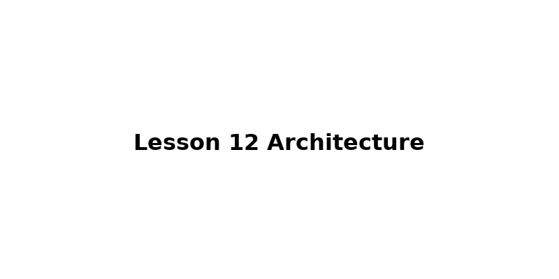
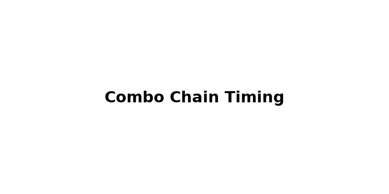
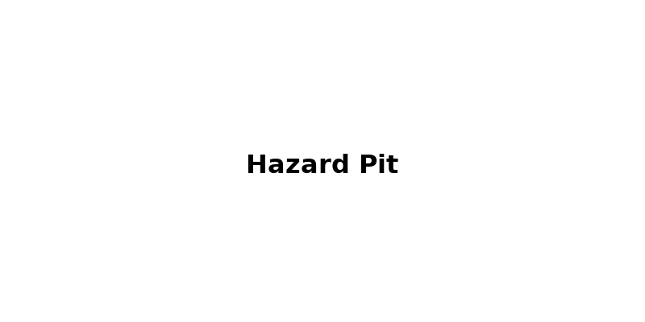
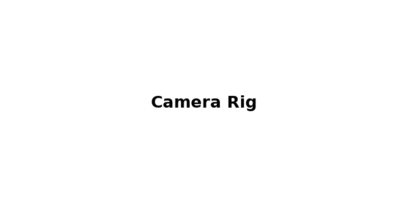

## License
This project is licensed under the **UZ Learn Try Personal Education License (UT-PEL) v1.0**.
**Not** open source. **Personal self-learning only.** No redistribution, no public hosting, no derivatives, no commercial or instructional use, and no AI/data-mining. See [LICENSE](../LICENSE).

---

# Lesson 12 — Combat, Hazards & Responsive Camera (Steps 1–7)

> **From traversal to combat:** this lesson upgrades our 2.5D platformer with  
> ⚔️ *attack chaining*, ☠️ *hazards*, 🎥 *cinematic camera rig*, and ✨ *polish systems*.  

---

## TL;DR

- **Combat System:** 3-hit combo chain, facing-based hitboxes, cooldown windows.  
- **Hazards:** Solid spike pits that kill on touch — no jump-through exploits.  
- **Camera:** OrbitControls rig with fixed radius, azimuth/polar constraints, smooth reset.  
- **Checkpoints:** Glowing spheres, emissive feedback, respawn with invulnerability.  
- **FX Polish:** Dust bursts, screen flash, camera shake.  

---

## Quick Start

1. Clone or copy the **seven HTML files** (`step-01.html` … `step-07.html`) into a folder.  
2. Run a local server:  
   ```bash
   npx http-server .
   # or: python -m http.server 8000
   ```  
3. Open `step-07.html` in a modern browser.  
4. Controls:  
   - **W / ↑ / Space** — Jump  
   - **A / D** — Walk / Air control  
   - **J / Left-Click** — Attack (combo chain)  
   - **Arrow Keys** — Adjust camera orbit  

---

## Keyboard & Mouse Reference

| Input | Action |
|---|---|
| **A / D** | Move left / right |
| **W / ↑ / Space** | Jump |
| **J** | Attack (same as left mouse click) |
| **Arrow Keys** | Adjust orbit camera (azimuth/pitch) |
| **Mouse Drag** | Rotate camera (OrbitControls) |
| **Checkpoints** | Auto-save respawn point |
| **Hazards** | Instant respawn with flash + shake |

---

## Project Structure (Steps 1–7)

```
step-01.html   Base combat input
step-02.html   Attack hitbox + facing
step-03.html   Combo chain (3 hits)
step-04.html   Hazards (spike pits) kill on touch
step-05.html   Respawn + checkpoints
step-06.html   Camera rig with constraints
step-07.html   Polish: dust, flash, shake
```



---

## Key Systems

### 1. Combat (3-Hit Combo)

- **Facing-based hitbox:** Always spawns in front of player along X.  
- **Combo window:** Each attack must be timed during cooldown to chain.  
- **Hitbox Debug Mesh:** Red transparent box (toggle in code).  



### 2. Hazards

- Solid, no jump-through.  
- Kill player instantly when capsule touches spike mesh AABB.  
- On death:  
  - White **screen flash**  
  - Camera **shake**  
  - Respawn at last checkpoint  



### 3. Camera Rig

- Fixed radius (10).  
- Constrained azimuth (±45°) and pitch (−75° to +15°).  
- Smooth reset to default angles when idle.  
- Drag and arrow-key nudges both supported.  



### 4. Checkpoints

- Sphere with emissive glow.  
- On contact:  
  - Saves respawn point  
  - Visual feedback (color shift, scaling pulse)  
  - Respawn returns here with brief invulnerability  

---

## Tuning Constants

| Constant | Default | Notes |
|---|---:|---|
| `jumpStrength` | 9.5 | Launch speed |
| `gravityUp` | 14 | While holding jump |
| `gravityCut` | 26 | When releasing early |
| `gravityFall` | 34 | Faster descent |
| `attackMax` | 0.35 s | Attack duration per swing |
| `maxSpeed` | 6.0 | Horizontal max speed |
| `accelGround` | 40 | Acceleration on ground |
| `accelAir` | 28 | Faster mid-air turn |

---

## Flow of a Frame

```mermaid
flowchart TD
  A[Input capture] --> B[Jump/Attack buffers]
  B --> C[Gravity integration]
  C --> D[Horizontal integration]
  D --> E[Platform collisions]
  E --> F[Hazard check (capsule vs spikes)]
  F --> G[Combo attack logic + hitboxes]
  G --> H[Camera orbit update]
  H --> I[FX (dust, flash, shake)]
```

---

## Read More

- *Game Feel* by Steve Swink — Chapter on “Juice”.  
- GDC talks on action combat.  
- Three.js docs — `OrbitControls`, materials, shadows.  
- Articles on input buffering and coyote time in platformers.  

---

## Challenges

- Extend combo to 4 hits with finisher animation.  
- Add directional attacks (up-slash, down-stab).  
- Air cancel into double-jump.  
- Moving hazard variants.  

---

— Updated 2025-09-29 20:11 UTC

Made with ❤️ for the wonderful journey in a 3D world.
Happy rendering!

---

## Trademark Notice

**UZ LEARN TRY™** is the brand identity of this project.
The name and materials are provided strictly for personal educational purposes.
All rights reserved.
