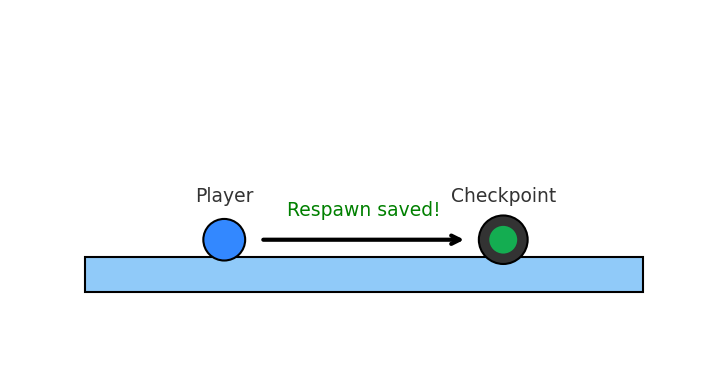
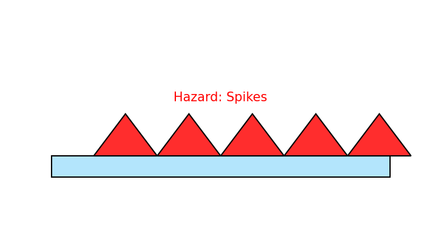
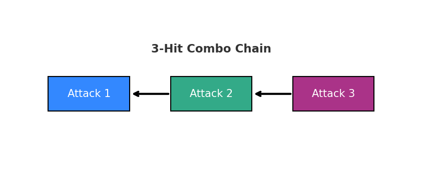

## License
This project is licensed under the **UZ Learn Try Personal Education License (UT-PEL) v1.0**.
**Not** open source. **Personal self-learning only.** No redistribution, no public hosting, no derivatives, no commercial or instructional use, and no AI/data-mining. See [LICENSE](../LICENSE).

---

# Lesson 12 — Combat, Hazards & Responsive Camera (Steps 1–7)

> **From traversal to combat:** this lesson upgrades our 2.5D platformer with  
> ⚔️ *attack chaining*, ☠️ *hazards*, 🎥 *cinematic camera rig*, and ✨ *polish systems*.  

---

## TL;DR

- **Combat System:** 3-hit combo chain, facing-based hitboxes, cooldown windows.  
- **Hazards:** Solid spike pits that kill on touch — no jump-through exploits.  
- **Camera:** OrbitControls rig with fixed radius, azimuth/polar constraints, smooth reset.  
- **Checkpoints:** Glowing spheres, emissive feedback, respawn with invulnerability.  
- **FX Polish:** Dust bursts, screen flash, camera shake.  

## 🖼 Demo Overview

  
*A glowing checkpoint that saves respawn position.*

  
*Spikes that respawn the player upon touch.*

  
*3-hit attack combo chain demonstration.*

---

## Quick Start

1. Clone or copy the **seven HTML files** (`step-01.html` … `step-07.html`) into a folder.  
2. Run a local server:  
   ```bash
   npx http-server .
   # or: python -m http.server 8000
   ```  
3. Open `step-07.html` in a modern browser.  
4. Controls:  
   - **W / ↑ / Space** — Jump  
   - **A / D** — Walk / Air control  
   - **J / Left-Click** — Attack (combo chain)  
   - **Arrow Keys** — Adjust camera orbit  

---

## Keyboard & Mouse Reference

| Input | Action |
|---|---|
| **A / D** | Move left / right |
| **W / ↑ / Space** | Jump |
| **J** | Attack (same as left mouse click) |
| **Arrow Keys** | Adjust orbit camera (azimuth/pitch) |
| **Mouse Drag** | Rotate camera (OrbitControls) |
| **Checkpoints** | Auto-save respawn point |
| **Hazards** | Instant respawn with flash + shake |

## Project Structure (Steps 1–7)

```
step-01.html   Base combat input
step-02.html   Attack hitbox + facing
step-03.html   Combo chain (3 hits)
step-04.html   Hazards (spike pits) kill on touch
step-05.html   Respawn + checkpoints
step-06.html   Camera rig with constraints
step-07.html   Polish: dust, flash
```

---
## 🔑 Key Concepts

| Concept | Explanation |
|---------|-------------|
| **Checkpoints** | Save respawn points when touched; glow & scale effect shows activation. |
| **Hazards** | Spike pits with invisible collider boxes – touching them resets hero to last checkpoint. |
| **3-Hit Combo** | Attack chaining system with short cooldowns (0.35s), supports spamming with animation FX. |
| **Camera Tracking** | Always glued to hero with arrow key + mouse drag support, reset when idle. |
| **Platform Collisions** | Ground platforms block from above only (no jump-through for global ground). |
| **Dust FX** | Visual feedback when landing or attacking. |
| **Coyote Time** | Short grace period (0.12s) after leaving a platform still allows a jump. |

## 🚀 Step-by-Step Breakdown

1. **Platforms** – created using `makeBlock()`.  
2. **Checkpoints** – glowing spheres; touching them sets respawn.  
3. **Hazards** – spike pits built with cones + invisible collider.  
4. **Camera** – follows hero, arrow keys/mouse drag to rotate.  
5. **Combat** – left-click or `J` key triggers attacks.  
6. **3-Hit Combo** – chaining attack states into a sequence.  
7. **Final Polish** – dust FX, respawn flash, screen shake.

---

## Flow of a Frame

```mermaid
flowchart TD
  A[Input capture] --> B[Jump/Attack buffers]
  B --> C[Gravity integration]
  C --> D[Horizontal integration]
  D --> E[Platform collisions]
  E --> F[Hazard check (capsule vs spikes)]
  F --> G[Combo attack logic + hitboxes]
  G --> H[Camera orbit update]
  H --> I[FX (dust, flash, shake)]
```

---

## 🛠 Troubleshooting

| Problem | Cause | Fix |
|---------|-------|-----|
| Hero falls through ground | Collider logic not applied to global ground | Ensure `makeBlock` ground uses width ≥ 30 and `box.setFromObject()` called each frame |
| Camera doesn’t follow hero | `updateCamera(dt)` not running | Verify `onTick()` calls `updateCamera(dt)` |
| Attack doesn’t trigger while moving | Pointer event swallowed by controls | Use capture-phase listeners or fallback key (`J`) |
| Hazards don’t kill hero | `group.userData.box` missing | Check `makeSpikePit` sets `userData.box` properly |
| Checkpoint not saving | Distance threshold too small | Increase allowed `dx, dy` ranges (e.g. 0.6, 0.7) |

---

## Challenges

- Extend combo to 4 hits with finisher animation.  
- Moving hazard variants.  
- Give checkpoints a **sound effect** when activated.  

## 📚 Extra Reading

- [Three.js Docs – Object3D & Mesh](https://threejs.org/docs/)  
- [Game Programming Patterns – State Machines](http://gameprogrammingpatterns.com/state.html)  
- [Platformer Mechanics Explained](https://www.gamedeveloper.com/design/platformer-level-design)  
- [Easing & Timing Functions](https://easings.net/)  
— Updated 2025-09-29 20:11 UTC

Made with ❤️ for the wonderful journey in a 3D world.
Happy rendering!

---

## Trademark Notice

**UZ LEARN TRY™** is the brand identity of this project.
The name and materials are provided strictly for personal educational purposes.
All rights reserved.
