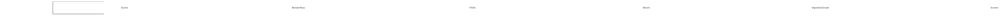
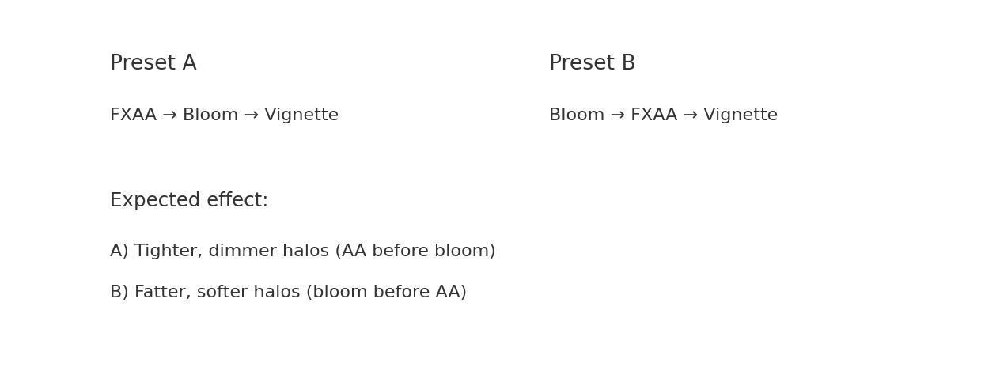
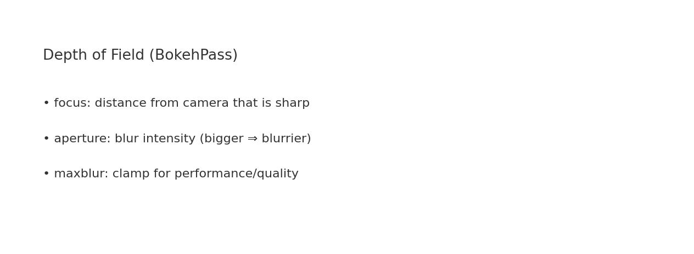

## License
This project is licensed under the **UZ Learn Try Personal Education License (UT-PEL) v1.0**.  
**Not** open source. **Personal self-learning only.** No redistribution, no public hosting, no derivatives, no commercial or instructional use, and no AI/data-mining. See [LICENSE](../LICENSE).

---

# 🎬 Lesson 09 — Post‑Processing Pipeline with three.js (EffectComposer)

Welcome! This lesson evolves your Lesson 08 scene into a **cinematic post‑processing pipeline** using three.js **EffectComposer**.  
We keep the exact **scene, lights, camera, and controls**, and add a chain of **passes** you can enable/tune live.

## ✨ What you’ll build
- A scene rendered through **EffectComposer → RenderPass → (FXAA → Bloom → Vignette/Grade)** → screen.
- Toggle and tune passes in real time.
- See why **pass order matters** and how **DoF** adds depth cues.
- A small perf HUD and DPI toggle to compare quality/perf.



## 📦 Files (Step 1 → 7)
- [Step 01 — Composer setup](./09-01-composer-setup.html): Introduces `EffectComposer` and `RenderPass` (replaces `renderer.render`).
- [Step 02 — FXAA](./09-02-fxaa.html): Adds `ShaderPass(FXAAShader)` for screen‑space anti‑aliasing; resolution uniform updates on resize.
- [Step 03 — Bloom](./09-03-bloom.html): Adds `UnrealBloomPass` (strength, radius, threshold) and hotkeys to tune it live.
- [Step 04 — Vignette & Grade](./09-04-vignette-and-grade.html): Custom `ShaderPass` with **lift/gamma/gain** and a vignette mask.
- [Step 05 — Bokeh DoF](./09-05-bokeh-dof.html): Adds **depth‑of‑field** with `BokehPass` (focus, aperture).
- [Step 06 — Chain & Order](./09-06-chain-and-order.html): Demonstrates how **FXAA↔Bloom** order changes halo look; single‑view toggle.
- [Step 07 — Presets & Performance](./09-07-presets-and-performance.html): Presets (Clean/Filmic/Dreamy/Off), DPR toggle, tiny FPS/ms HUD, clamps & reset.

## 🧠 New concepts
- **EffectComposer**: a film‑style pipeline of full‑screen passes.
- **ShaderPass**: wrap a GLSL shader as a post step (FXAA, custom grade).
- **UnrealBloomPass**: thresholded blur for cinematic glows.
- **BokehPass**: approximate camera depth‑of‑field in post.
- **Pass order**: upstream changes alter downstream results (AA before/after bloom).



## 🎹 Controls (common across steps)
- **Mouse**: drag to orbit · **Shift+Drag** to pan · **Wheel** to dolly.
- **FXAA**: press **F** (Step 2).
- **Bloom**: **[/** **]** strength · **;/** **'** radius · **,/** **.** threshold (Steps 3,6,7).
- **Vignette/Grade**: **V** toggle · **1/2/3** lift/gamma/gain (Step 4).
- **DoF**: **←/→** focus · **↑/↓** aperture (Step 5).
- **Order (Step 6)**: **1** = FXAA→Bloom · **2** = Bloom→FXAA · **Space** toggles.
- **Presets (Step 7 fixed)**: **1** Clean · **2** Filmic · **3** Dreamy · **0** Off (raw).
- **Grade (Step 7 fixed)**: **U** lift · **I** gamma · **O** gain · **R** reset grade & bloom.
- **Misc**: **P** DPR toggle · **D** neon demo on/off.

## 🛠️ Import‑map + examples/jsm fix
If you saw a **black screen** with only overlays, it was the browser failing to resolve `import "three"` inside `examples/jsm/*`.  
Solution: **import map** in each HTML:
```html
<script type="importmap">
{
  "imports": {
    "three": "https://unpkg.com/three@0.158.0/build/three.module.js"
  }
}
</script>
```
Then import passes via absolute URLs from the same version:
```js
const THREE = await import('three');
const { EffectComposer } = await import('https://unpkg.com/three@0.158.0/examples/jsm/postprocessing/EffectComposer.js');
```

## 👀 Depth of Field quick reference


- **focus** — distance from the camera that is crisply sharp.
- **aperture** — blur intensity (bigger ⇒ blurrier bokeh).
- **maxblur** — clamp for performance/quality.

## ⚙️ Performance tips
- Prefer **FXAA** over MSAA when using post‑processing; set `antialias:false` and rely on FXAA.
- Keep **DPR** modest (`1.0`–`1.5`) for heavy chains (Bloom+DoF).
- Clamp user‑tweakable params and provide **Reset** hotkeys.
- Chain order: Start with **FXAA → Bloom** for tighter glows; swap order for dreamier halos.

## 🧩 Troubleshooting
- **Black screen, text visible**: module import failed. Ensure the **import map** and examples paths match the same version (`0.158.0`).
- **No difference in order**: set **DPR=1** and enable the **neon** helper to create high‑contrast edges.
- **Values keep increasing**: use the **fixed Step 7** where presets are on **1/2/3/0** and grade uses **U/I/O** (with clamps + reset).

Made with ❤️ for your Lesson 08 → 09 pipeline upgrade.  
Happy rendering!

---

## Trademark Notice

**UZ LEARN TRY™** is the brand identity of this project.  
The name and materials are provided strictly for personal educational purposes.  
All rights reserved.
