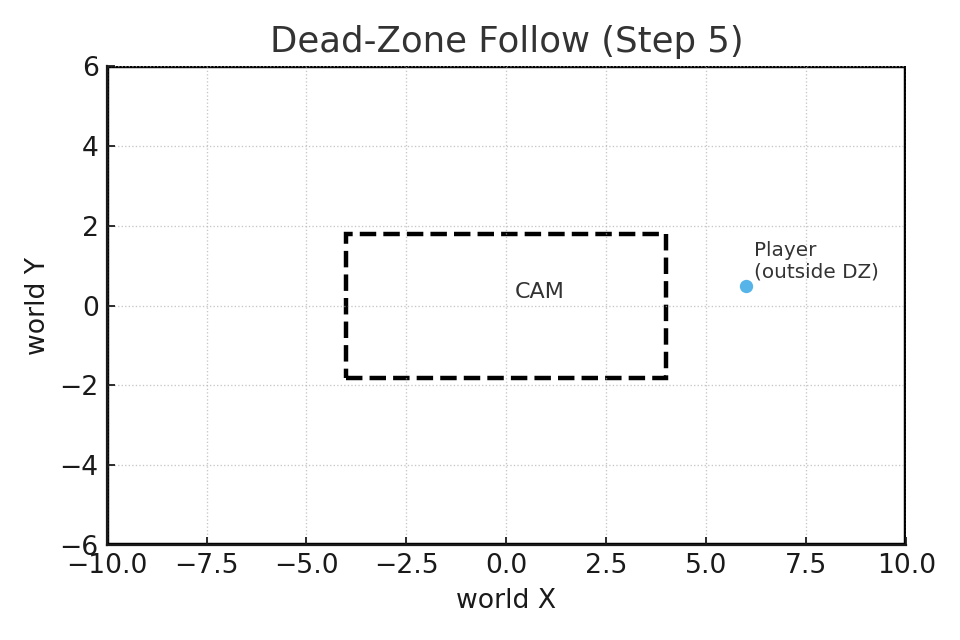

## License
This project is licensed under the **UZ Learn Try Personal Education License (UT-PEL) v1.0**.
**Not** open source. **Personal self-learning only.** No redistribution, no public hosting, no derivatives, no commercial or instructional use, and no AI/data-mining. See [LICENSE](../LICENSE).

---

# 🎮 Lesson 10 — Side-View Camera Rig for 2.5D (Three.js)

## 🚀 What you’ll build
- A **side-view camera rig** that keeps gameplay framed with an orthographic camera while allowing quick perspective comparisons.
- **Dead-zone following** so the player can move freely inside a buffer box before the camera reacts.
- **Layered parallax and tiling** for background/foreground strips that loop seamlessly as the world scrolls.

**Read more:** [Full Lesson 10 Guide (DOCX)](sandbox:/Lesson10_CameraRig_Readme+Guide.docx)

## 📦 Files (Step 1 → 7)
1. [Step 01 — Ortho Side-View Base](./10-01-ortho-side-view.html): Establishes the orthographic camera, manual pan/zoom, and `P` to toggle perspective for comparison.
2. [Step 02 — Pixel Scale & Safe-Area](./10-02-pixel-scale-and-safe-area.html): Locks world units to **PIXELS_PER_UNIT**, recomputes the frustum on resize, and overlays a safe-area frame.
3. [Step 03 — Parallax Layers](./10-03-parallax-layers.html): Splits the scene into BG/Mid/FG groups, applies shared `applyParallax()`, debug bars (`H`), auto-pan (`Space`), and quick preset keys `1–4`.
4. [Step 04 — Tiling Background](./10-04-tiling-background.html): Builds reusable tile prefabs for BG/FG, repositions them based on camera width, and exposes tile-bound overlays (`T`).
5. [Step 05 — Follow Camera + Dead-Zone](./10-05-follow-camera-deadzone.html): Adds player motion, critically damped spring follow, and live dead-zone resizing with `[ ]` (width) and `;`/`'` (height).
6. [Step 06 — Bounds & Clamp](./10-06-bounds-and-clamp.html): Defines world extents, clamps the desired camera center (with auto-center when view ≥ world), and provides clamp/world-size toggles.
7. [Step 07 — Presets & Polish](./10-07-presets-and-polish.html): Finalizes filmic vs pixel-art presentation (`V`), DPR handling, optional letterbox mask (`O`), and consolidated parallax resets (`R`).

## 🧠 New concepts
- **Dead-zone logic:** Only chase the player when they exit a configurable box, reducing micro jitter.
- **Critically damped spring:** Uses velocity feedback (`k` and `2√k`) for responsive easing that avoids overshoot.
- **Parallax factors:** Layer offsets use `cam * (1 − factor)` so BG (<1) lags, mid (=1) matches, and FG (>1) races ahead.
- **Horizontal tiling:** Prefab strips reposition relative to the view width to create endless scrolling scenery.
- **World clamping:** Clamp the desired camera center to `{min,max}` bounds and fall back to centering if the view is larger than the play space.

## 🎹 Controls
- **Camera + scale:** Drag to pan · Wheel or **K/L** to adjust PIXELS_PER_UNIT · **P** toggles Ortho/Persp · **Space** runs the auto demo (pan in Steps 3–4, run in Steps 5–7).
- **Parallax & overlays:** **1–4** preset parallax factors · **H** shows debug parallax bars · **T** toggles tile bounds.
- **Player & dead-zone:** **A/D** or **←/→** move horizontally · **W/S** or **↑/↓** test vertical motion · **[ ]** widen/narrow the dead-zone · **;**/**'** adjust dead-zone height.
- **World bounds:** **M** toggles clamp logic · **B** shows world rectangle · **- / =** change world width · **, / .** change world height.
- **Visual polish (Step 7):** **V** switches Filmic ↔ Pixel-Art mode · **O** toggles the letterbox mask · **R** resets visual presets.

## 🧭 Visual references
### Dead-zone follow window

*The outer rectangle is the camera view in world units. The dashed inner box is the dead-zone (40%×30%). The camera only moves when the player exits this box; the `+` marks the camera center.*

### World bounds clamp

*The green rectangle is the world bounds. The dashed view shows the desired target; the solid view shows the clamped result so the camera never reveals space outside the level.*

### Parallax layer offsets

*For a given `camX`, each layer gets an offset `camX*(1−f)`. Background (f≈0.25) moves least, foreground (f>1) moves most, mid/gameplay (f=1) tracks the camera exactly.*

### Critically damped follow response

*The camera (solid) eases toward the target (dashed) using a critically damped spring (k=60, c=2√k): quick response, minimal overshoot, stable at rest.*

## 🧾 Guidance
### Performance tips
- Keep **PIXELS_PER_UNIT** between roughly 32–128 for most scenes; higher values amplify per-frame tile updates and can reveal seams if textures lack padding.
- Reuse the shared `applyParallax()` for tiles, debug bars, and layers so each frame computes offsets once.
- Disable helpers (**H**, **T**, **B**) when profiling—each adds dozens of meshes or lines that increase overdraw.
- In Pixel-Art mode, lock DPR to 1 via `V` before recording footage to avoid inconsistent sampling.

### Troubleshooting
- Camera drifting outside the level usually means clamp is off—hit **M** and confirm world width/height exceed the current view; if the view is larger, the rig intentionally recenters.
- If PPU changes stretch sprites, ensure every `setPPU()` call recomputes the orthographic frustum before rendering.
- Seeing gaps in tiled strips? Verify tile widths match the reposition math and that `showTileBounds` (`T`) is off when judging seams.
- Parallax layers marching in sync indicates factors reverted to 1—tap **2** (Filmic preset) or reapply your custom factors and confirm `applyParallax()` runs after camera updates.

— Updated 2025-09-17 13:37 UTC

Made with ❤️ for your Lesson 08 → 09 pipeline upgrade.
Happy rendering!

---

## Trademark Notice

**UZ LEARN TRY™** is the brand identity of this project.
The name and materials are provided strictly for personal educational purposes.
All rights reserved.
